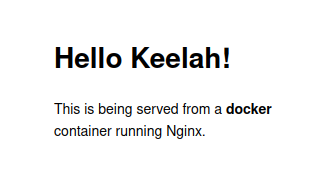

# Basically a Docker course

> ## Base Commands

> ### Run docker containers in interactive mode
`docker run -it alpine /bin/sh` 

```
╭─ keelah     ~/Documents/CPE-Keelah    main ⇣1⇡1 *2 ?1
╰─ docker run -it alpine /bin/sh
/ # ls -l
total 56
drwxr-xr-x    2 root     root          4096 Jan  9 12:46 bin
drwxr-xr-x    5 root     root           360 Jan 30 09:50 dev
drwxr-xr-x    1 root     root          4096 Jan 30 09:50 etc
drwxr-xr-x    2 root     root          4096 Jan  9 12:46 home
drwxr-xr-x    7 root     root          4096 Jan  9 12:46 lib
drwxr-xr-x    5 root     root          4096 Jan  9 12:46 media
drwxr-xr-x    2 root     root          4096 Jan  9 12:46 mnt
drwxr-xr-x    2 root     root          4096 Jan  9 12:46 opt
dr-xr-xr-x  488 root     root             0 Jan 30 09:50 proc
drwx------    1 root     root          4096 Jan 30 09:50 root
drwxr-xr-x    2 root     root          4096 Jan  9 12:46 run
drwxr-xr-x    2 root     root          4096 Jan  9 12:46 sbin
drwxr-xr-x    2 root     root          4096 Jan  9 12:46 srv
dr-xr-xr-x   13 root     root             0 Jan 30 09:50 sys
drwxrwxrwt    2 root     root          4096 Jan  9 12:46 tmp
drwxr-xr-x    7 root     root          4096 Jan  9 12:46 usr
drwxr-xr-x   12 root     root          4096 Jan  9 12:46 var
/ # uname -a
Linux aac6ccd912ee 6.1.8-arch1-1 #1 SMP PREEMPT_DYNAMIC Tue, 24 Jan 2023 21:07:04 +0000 x86_64 Linux
/ # exit

```

> ### See all docker containers

`docker ps -a`

> ### Pull an image

Get a specific version of an image  
`docker pull ubuntu:12.04`  

Or get the latest version  
`docker pull ubuntu`


> ## Static website

`docker run -d dockersamples/static-site`  
Nothing happens

`docker run --name static-site -e AUTHOR="Keelah" -d -P dockersamples/static-site`  
```
╭─ keelah     ~/Documents/CPE-Keelah    main ⇣1⇡1 *2 ?1 
╰─ docker port static-site 
80/tcp -> 0.0.0.0:32769
80/tcp -> :::32769
443/tcp -> 0.0.0.0:32768
443/tcp -> :::32768
```


```
╭─ keelah     ~/Documents/CPE-Keelah    main ⇣1⇡1 *2 ?1 
╰─ docker run --name static-site-2 -e AUTHOR="Keelah but better" -d -p 8888:80 dockersamples/static-site
cbfaa455747b4680ff3e0796a53e61424e734ce47802478ec44de52846f33e07

╭─ keelah     ~/Documents/CPE-Keelah    main ⇣1⇡1 *2 ?1
╰─ docker port static-site-2                                                                            
80/tcp -> 0.0.0.0:8888
80/tcp -> :::8888
```

> ### Remove containers 

`docker stop static-site`  
`docker rm static-site`  
`docker rm -f static-site-2`  

> ## Build an image

> ### Le Dockerfile

```dockerfile
# Indicates the base image(s) required to build our image
FROM alpine:3.6

# Run commands on the build image
RUN apk add --update py2-pip

# copy files to our image²
COPY requirements.txt /usr/src/app/
RUN pip install --no-cache-dir -r /usr/src/app/requirements.txt

COPY app.py /usr/src/app/
COPY templates/index.html /usr/src/app/templates/

# Specify what ports are opened 
EXPOSE 5000

# Specify the command to run to launch the app
CMD ["python", "/usr/src/app/app.py"]
```

`docker run -p 8888:5000 --name furballs keelah/random-furball`  
